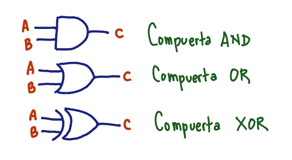
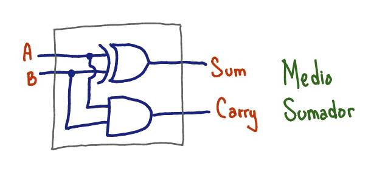
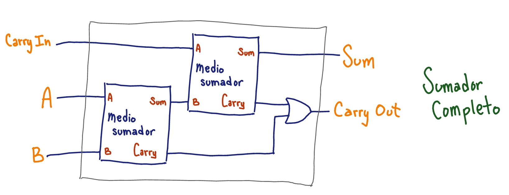
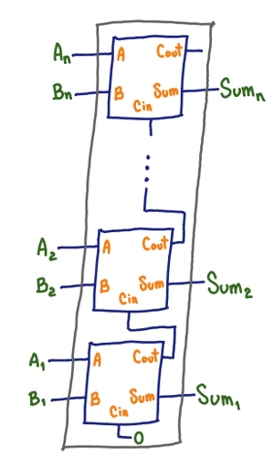

= Logic Add

Este repositorio contiene la solución al https://www.facebook.com/plugins/post.php?href=https%3A%2F%2Fwww.facebook.com%2Faesc.cem%2Fposts%2F1574555849264973&width=500[AntiCodeChallenge de AESC]: _Hacer el método que calcule la suma de dos números enteros de la forma más compleja que se les ocurra._

== Forma de uso

- Para instalar el programa y usarlo como módulo solo se requiere copiar el archivo `src/logic_add.py` al directorio de trabajo. 

- Para correr las pruebas unitarias, teclear desde la terminal:
+
----
$ python3 logic_add.py
----
+
Una salida vacía indica que se pasan todas las pruebas.

- A continuación tenemos un ejemplo para usar el módulo `logic_add` desde el shell de Python:
+
[source, python]
----
>>> from logic_add import add
>>> add(2, 3)
5
----
- Por omisión la función `add` utiliza 32 bits de precisión para realizar la operación de suma. Se puede indicar otra cantidad de bits como tercer argumento. Los bits más significativos excedentes se truncan del resultado:
+
[source, python]
>>> add(128, 129, 8)
1
+
Dicho de otra forma, `add(x, y, n)` equivale a:
+
----
(x + y) % (2 ** n)
----
- Todos los números enteros que recibe la función `add` se consideran en complemento a dos. Esto quiere decir que el bit más significativo es el signo (si es igual a 1 el número es negativo, si es igual a 0 es positivo).
+
[source, python]
----
>>> add(5, -20)
-15
>>> add(-1, -1)
-2
>>> add(-5, 5)
0
>>> add(254, 1, 8)
-1
>>> add(-2, -1, 2)
1
----

== Descripción de la solución

Este programa resuelve el problema en cuestión simulando en software las siguientes tres compuertas lógicas:

Cada tipo de compuerta es una clase (`AndGate`, `OrGate` y `XorGate`). Las compuertas a su vez se conectan usando objetos de tipo `Wire`. Los objetos `Wire` y las compuertas lógicas implementan en su conjunto el *patrón de diseño de observador* (Gamma, et al. 1994). La mayor parte del flujo del programa ocurre en el contexto de este patrón.

[source, python]
----
>>> in1 = Wire()
>>> in2 = Wire()
>>> out = Wire()
>>> AndGate(in1, in2, out)
<logic_add.AndGate object at 0x10458efd0>
>>> Display('Out', out)
<logic_add.Display object at 0x10458edd8>
>>> in1.set(1)
>>> in2.set(1)
Out: 1
----
La compuerta AND creada en el código anterior se registra como observador de sus dos línea de entrada (`in1` e `in2`). Cuando se establece un valor en alguna de estas líneas (a través del método `set`), la compuerta es notificada y en su momento establece un valor resultante en su línea de salida (`out`). 

Con esta infraestructura podemos crear fácilmente un *medio sumador*:

El código de un medio sumador queda así:

[source, python]
----
class HalfAdder:
    def __init__(self, A, B, Sum, Carry):
        XorGate(A, B, Sum)
        AndGate(A, B, Carry)
----

Y con dos medios sumadores podemos hacer un *sumador completo*:

El código del sumador completo es:

[source, python]
----
class FullAdder:
    def __init__(self, A, B, CarryIn,
                 Sum, CarryOut):
        wire1 = Wire()
        wire2 = Wire()
        wire3 = Wire()
        HalfAdder(A, B, wire1, wire2)
        HalfAdder(CarryIn, wire1, Sum, wire3)
        OrGate(wire3, wire2, CarryOut)
----

Si queremos sumar dos números de _n_ bits cada uno, basta con crear _n_ sumadores completos y conectarlos adecuadamente:

== Bibliografía

- Abelson, H. & Sussman, G. https://mitpress.mit.edu/sicp/full-text/sicp/book/node64.html[“A Simulator for Digital Circuits”.] Accedido el 11 de marzo de 2018.

- Agarwal, T. https://www.elprocus.com/half-adder-and-full-adder/[“Explain Half Adder and Full Adder with Truth Table”.] Accedido el 11 de marzo de 2018.

- Gamma, E., Helm, R., Johnson, R., & Vlissides, J. “Design Patterns: Elements of Reusable Object-Oriented Software”. Addison-Wesley, 1994.

- Python Software Foundation. https://docs.python.org/3/library/index.html[“The Python 3.6.4 Standard Library”.] Accedido el 11 de marzo de 2018.
